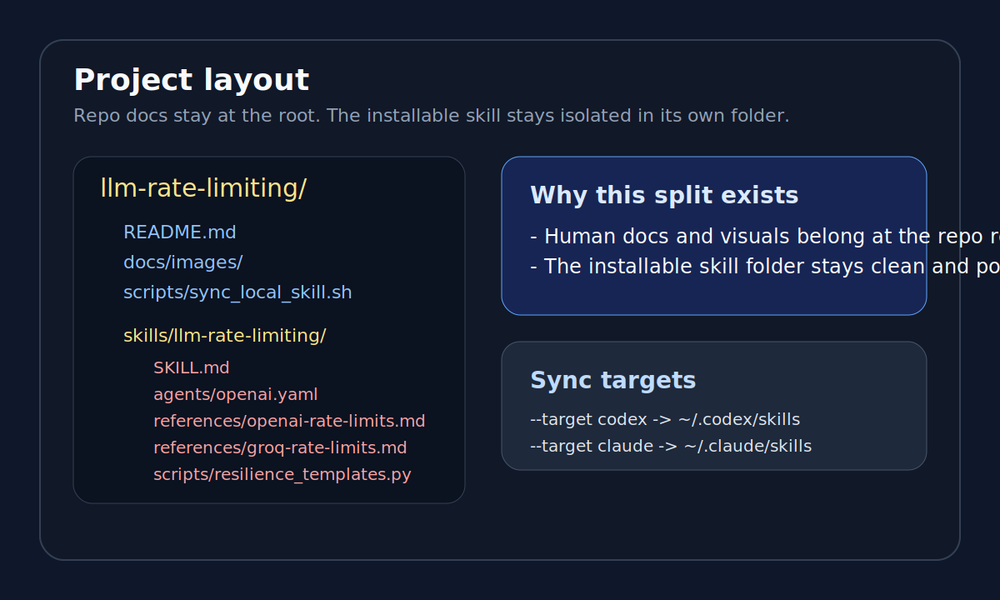
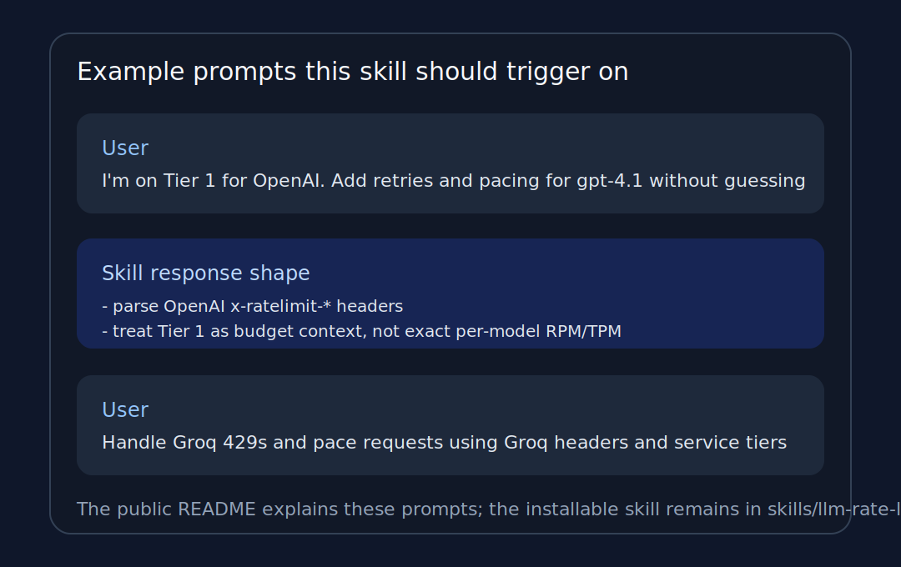

# LLM Rate Limiting

`llm-rate-limiting` is a public skill project for teaching coding agents how to add provider-aware rate limiting, retries, quota handling, and resilience patterns to LLM integrations. It is built for real API constraints such as OpenAI usage tiers, response headers, shared model buckets, and Groq rate-limit semantics.



## What This Project Contains

- A clean, installable skill in `skills/llm-rate-limiting/`
- Provider guides for OpenAI and Groq
- A reusable Python template for retry, backpressure, and circuit-breaker logic
- Human-facing docs and examples at the repo root

## Provider Coverage

| Provider | Guide | Covered topics |
| --- | --- | --- |
| OpenAI | `references/openai-rate-limits.md` | usage tiers, org/project/model scopes, shared limits, long-context buckets, `x-ratelimit-*` headers |
| Groq | `references/groq-rate-limits.md` | RPM/RPD/TPM/TPD/ASH/ASD, cached tokens, `retry-after`, `service_tier`, header semantics |

## Install

### Auto-detect local install

```bash
git clone https://github.com/SeeknnDestroy/llm-rate-limiting.git
cd llm-rate-limiting
bash scripts/sync_local_skill.sh
```

By default, the script will:

- use an existing Codex-style skills directory if one is present
- otherwise use an existing Claude Code-style skills directory if one is present
- otherwise fall back to `${CODEX_HOME:-$HOME/.codex}/skills`

### Explicit target selection

```bash
bash scripts/sync_local_skill.sh --target codex
bash scripts/sync_local_skill.sh --target claude
bash scripts/sync_local_skill.sh --target-dir /absolute/path/to/skills
```

### Manual install

Copy the `skills/llm-rate-limiting/` folder into your local skills directory:

```bash
cp -R skills/llm-rate-limiting "${CODEX_HOME:-$HOME/.codex}/skills/"
cp -R skills/llm-rate-limiting "${CLAUDE_HOME:-$HOME/.claude}/skills/"
```

## Example Prompts

- `Use $llm-rate-limiting to add OpenAI-aware retries and pacing to my Python client.`
- `I am on Tier 1 for OpenAI. Help me stay under model-specific rate limits without guessing from memory.`
- `Handle Groq 429s and pace requests using Groq headers and service tiers.`



## Repository Layout

- Human docs live at the repo root.
- The actual installable skill lives in `skills/llm-rate-limiting/`.
- There is intentionally no `README.md` inside the skill folder so the skill stays compliant with skill-folder best practices.

## Notes

- This repo is the source of truth.
- The local installed skill is a synced artifact.
- Initial provider scope is OpenAI and Groq; the structure is meant to make Anthropic and Gemini easy to add next.

If you find this useful, star the repo and adapt the skill to your own provider stack.
